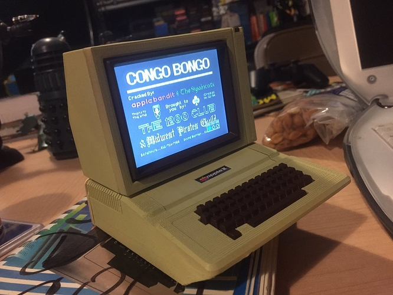

# Apple IIe Mini powered by C.H.I.P
Here you will find everything you need to create your very own C.H.I.P. powered Apple IIe Mini computer.

# How it works
This Apple IIe mini is completely self contained and has a battery life of about 10 hours give or take.  I haven't actually tested it, so I'm guessing based on the stated life of the battery and the amount of currrent draw observed during testing.

The C.H.I.P. can use 3.3V to 5V power, however the LCD TFT screen requires 6V to 12V.  I solved this by using a 12V drone/RC battery and passed it through a cheap 5V buck converter to power the C.H.I.P.  I created a very simple PCB to accomplish this.  You do not need the PCB to complete this build, I created one just to keep things a bit tidy.

You can of course use a super cheap linear regular like an LM317 to do the same job, but the $5 buck converter is much more efficient and will extend the battery life.

A stock C.H.I.P is all you need, I could not get the emulator to run in headless mode, so you will need the standard firmware and then configure the emulator to auto run in the KDE desktop.

# Tools Required
- Soldering Iron
- Edge cutters (To cut off excess pins after soldering)
- Good 60/40 Solder
- 22 Guage or similar stranded hook up wire

# Electrical Components Required
If you are building it the exact same way I did, including the PCB this is what you will need
- 4x JS 2.0 PH Connectors Male & Female (For 12V In, 12V Out, Speaker Out, and Power Switch)
- 2x 40 Pin DIP headers
- 1x 4 pin 12v to 5v buck converter (Search EBay)
- 1x Small speaker (Digikey SP-1504 is what I used)
- 1x Lumineer 1300mAh 12V battery
- 1x Set of XT60 Drone battery connectors
- 1x 3S LiPo battery charger (Optional, but I'm sure you will want to charge the battery at some point)
- 1x 3.5" TFT LCD TV from Adafruit (https://www.adafruit.com/products/913)
- 1x Pushbutton toggle switch for power (https://www.adafruit.com/product/1683)

# 3D Prints
I used the excellent 3D models from Thingiverse of a user named option8 and printed them on my Zortrax M200 pinter at 0.19mm/Medium infill.  The original models are meant for a Raspberry Pi powered via USB, so I modified the base a bit for this self contained model.
- Apple II Enclosure (https://www.thingiverse.com/thing:340677)
- Apple II Monitor (http://www.thingiverse.com/thing:377253)
- Apple II Enclosed Base (http://www.thingiverse.com/thing:2103158)

I drilled a hole through the top of the enclosure into the monitor to run the wires for the monitor power, power switch, and video signals into the monitor.

Standard super glue seemed to work fine for gluing everything together.

# Paint
I followed option8's directions for painting with the following spray paints
- Montana GOLD (Sahara Yellow) for case
- Krylon Espresso for Keyboard/Accessories

# Video Signal
Unfortunately the composite video signal from the C.H.I.P. is not exposed on the pin headers, so I was forced to hack it in.  If you are able to find a small enough right angle 3.5mm to RCA video cable that works go for it.  I was not.

To hack in the video signal, simply attach a wire from the video signal on the C.H.I.P. PCB.  I have highlighted the correct pin here: [Video Pin](./BuildImages/VideoPin.png)

Connect the video GND to any available ground, I soldered it directly to the top of the 3.5mm connector on the C.H.I.P.

# Emulator
I am using stock LinApple-Pi which you can get here https://github.com/Cupcakus/linapple-pie

I have modified the original emulator a bit to make the menus more readable on the 320x240 screen.
